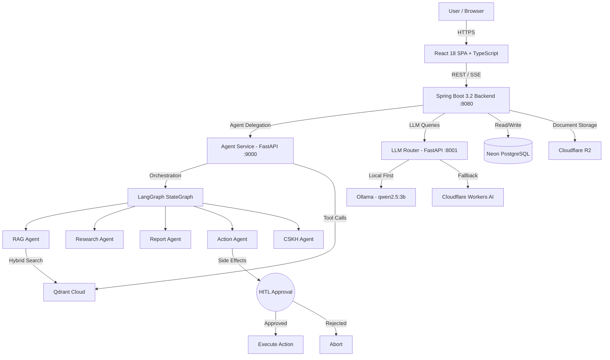
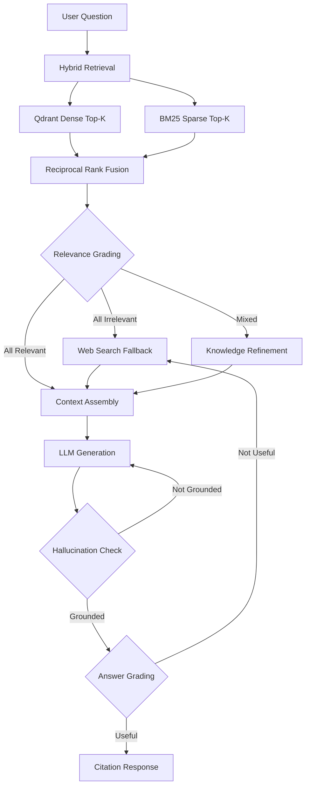

<div align="center">
  <h1>📄 Smart Document Chatbot — Enterprise RAG Q&A Platform</h1>
  <p><strong>Self-Hosted Document Intelligence with Corrective RAG, LangGraph Agents & Local-First LLM</strong></p>

  [](https://openjdk.org/)
  [](https://spring.io/)
  [](https://react.dev/)
  [](https://www.typescriptlang.org/)
  [](https://python.org/)
  [](https://fastapi.tiangolo.com/)
  [](https://langchain.com/)
  [](https://qdrant.tech/)
  [](https://docker.com)
  [](#)
  [](LICENSE)

  [](https://github.com/imtarget05/Smart-Document-Chatbot/actions)
</div>

---

**Smart Document Chatbot** is an enterprise-grade, self-hosted RAG (Retrieval-Augmented Generation) platform that lets users upload legal and business documents, ask questions in natural language (Vietnamese & English), and receive accurate, citation-backed answers with zero tolerance for hallucination. The system employs a **Corrective RAG (CRAG)** architecture with a 5-layer verification pipeline, a local-first LLM strategy via Ollama, and a LangGraph-powered autonomous agent capable of multi-step reasoning and Human-in-the-Loop (HITL) action execution.

Core workflow: `Upload → Retrieve → Verify → Cite → Answer`

## ✨ Key Features & Engineering Decisions

1. **Corrective RAG (CRAG) Pipeline**: 5-layer verification — Hybrid Retrieval → Relevance Grading → Knowledge Refinement → Hallucination Check → Answer Grading. If evidence is insufficient, the system honestly refuses rather than hallucinating.
2. **Hybrid Search with RRF**: Combines Dense (Qdrant cosine) + Sparse (BM25) retrieval, fused via Reciprocal Rank Fusion, ensuring high recall across semantic and keyword queries.
3. **Local-First LLM Strategy**: Routes through `LocalOllamaProvider` first (health probe with TTL cache). Falls back to Cloudflare Workers AI only when local is unavailable. No mid-request fallback — fail fast, fail clean.
4. **LangGraph Agent Orchestration**: Multi-agent architecture with 9 specialized agents (RAG, CSKH, Research, Report, Engineering Analysis, Ingestion, Action, Comparator) orchestrated by a central agent with state persistence.
5. **Human-in-the-Loop (HITL)**: Side-effect actions (document ingestion, external API calls) require explicit human approval before execution, preventing unintended mutations.
6. **Agent-First Routing**: All chat queries default to Agent mode (LangGraph multi-step reasoning) with RAG as fallback. The agent *reasons*, the RAG *retrieves* — each has its lane.
7. **Enterprise Security Stack**: JWT + CSRF + Rate Limiting (sliding-window; **fail-open** on Redis outage — deliberate availability-over-strictness trade-off) + CORS + SSO/Keycloak + Audit Logging + PII-aware guardrails. `SecretStrengthValidator` enforces strong secrets in staging/production.
8. **Real-Time Streaming**: Server-Sent Events (SSE) for token-by-token streaming with dedicated `SseStreamManager`, deduplication via `ChatDedupService`, and dead-letter queue via `ChatDlqService`.
9. **A/B Testing Framework**: Built-in experiment framework for comparing model performance, retrieval strategies, and prompt variants with statistical significance tracking.
10. **Cloud-Native Storage**: Neon PostgreSQL (managed), Qdrant Cloud (vector), Cloudflare R2 (document blobs) — all connected and verified.
11. **Durable Ingestion Queue (ADR-004)**: the async document workflow runs as a DB-backed job (idempotent enqueue via partial unique index, `FOR UPDATE SKIP LOCKED` claiming, exponential-backoff retry, lease-timeout crash recovery) with a durable dead-letter state replayable by admins — replacing the previous fire-and-forget `CompletableFuture`.

---

## 🏗️ Architecture

### System Topology & Request Lifecycle



### Corrective RAG (CRAG) Pipeline



---

## 🛠️ Tech Stack

| Category | Technologies |
|---|---|
| **Backend** | Java 17, Spring Boot 3.2, Spring Security, Flyway, Maven |
| **Agent Service** | Python 3.11+, FastAPI, LangGraph, LangChain, Google ADK |
| **LLM Router** | Python 3.11+, FastAPI, Ollama (qwen2.5:3b), Cloudflare Workers AI |
| **Frontend** | React 18, TypeScript 5, Vite, Tailwind CSS |
| **Vector Store** | Qdrant Cloud (Hybrid Dense + BM25 Sparse, RRF) |
| **Database** | Neon PostgreSQL (managed, Flyway migrations V1–V15) |
| **Object Storage** | Cloudflare R2 (S3-compatible) |
| **Embeddings** | nomic-embed-text (768-dim, local via Ollama) |
| **Observability** | Langfuse Tracing, Prometheus metrics, structured logging |
| **DevOps** | Docker, Docker Compose, GitHub Actions CI/CD, Render Blueprints |

---

## 🚀 Quick Start

### Prerequisites
- Java 17+, Maven 3.9+
- Python 3.11+
- Node.js 18+
- [Ollama](https://ollama.ai/) (for local LLM)
- Docker & Docker Compose (optional)

### Option 1: Docker Compose (Recommended)

```bash
cp .env.example .env   # Fill in your credentials
docker compose -f docker/docker-compose.yml up --build -d
```

### Option 2: Local Development

```bash
# Terminal 1: Pull LLM models & start Ollama
ollama pull qwen2.5:3b
ollama pull nomic-embed-text

# Terminal 2: Backend (Spring Boot)
cd backend
cp ../.env.example ../.env   # Configure credentials
mvn spring-boot:run

# Terminal 3: LLM Router
cd llm-router
python -m venv .venv && source .venv/bin/activate
pip install -r requirements.txt
uvicorn app.main:app --port 8001 --reload

# Terminal 4: Agent Service
cd agent
pip install -r requirements.txt
uvicorn main:app --port 9000 --reload

# Terminal 5: Frontend
cd frontend
npm install
npm run dev
```

---

## 📡 API Reference

### Backend (Spring Boot — :8080)

| Method | Endpoint | Description |
|:---|:---|:---|
| `POST` | `/api/auth/login` | JWT authentication |
| `POST` | `/api/auth/google` | Google OAuth2 / One Tap login |
| `POST` | `/api/chat` | Send query (Agent-first, RAG fallback) |
| `GET` | `/api/chat/stream` | SSE token-by-token streaming |
| `POST` | `/api/documents/upload` | Upload PDF/DOCX/TXT documents |
| `GET` | `/api/documents` | List uploaded documents |
| `GET` | `/api/history` | Conversation history |
| `GET` | `/api/health` | System health check |

### Agent Service (FastAPI — :9000)

| Method | Endpoint | Description |
|:---|:---|:---|
| `POST` | `/agent/chat` | LangGraph multi-step reasoning |
| `POST` | `/agent/ingest` | Document ingestion pipeline |
| `GET` | `/agent/actions/pending` | List pending HITL approvals |
| `POST` | `/agent/actions/confirm` | Approve/reject side-effect action |
| `POST` | `/memory/store` | Store long-term memory |
| `GET` | `/health` | Agent health + model status |

### LLM Router (FastAPI — :8001)

| Method | Endpoint | Description |
|:---|:---|:---|
| `POST` | `/api/chat` | Routed LLM inference (local-first) |
| `POST` | `/api/chat/stream` | Streaming LLM inference |
| `POST` | `/api/embeddings` | Generate embeddings (nomic-embed-text) |
| `GET` | `/api/models` | List available models |
| `GET` | `/health` | Router health + provider status |

---

## 📂 Project Structure

```text
├── backend/                    # Spring Boot 3.2 backend
│   ├── src/main/java/
│   │   ├── controller/         # REST controllers (Chat, Document, Auth, Admin)
│   │   ├── service/            # Business logic (ChatService, SseStreamManager, DedupService)
│   │   ├── model/              # JPA entities
│   │   ├── repository/         # Spring Data JPA repos
│   │   ├── config/             # Security, CORS, Rate Limiting, Flyway
│   │   └── dto/                # Request/Response DTOs
│   └── src/test/               # 283 JUnit tests (53 test classes)
├── agent/                      # Python Agent Service (FastAPI + LangGraph)
│   ├── agents/                 # 9 specialized agents (RAG, CSKH, Research, Report...)
│   ├── graph/                  # LangGraph StateGraph workflow
│   ├── routers/                # 8 FastAPI routers (chat, actions, admin, hitl, mcp...)
│   ├── tools/                  # Agent tools (Qdrant, Web Search, Notification, Report)
│   ├── memory/                 # Short-term, Long-term, Graph memory
│   ├── connectors/             # Gmail, Google Drive, Slack, SharePoint
│   ├── benchmark/              # Performance benchmarking framework
│   ├── eval_framework/         # Automated evaluation pipeline
│   └── tests/                  # 199 pytest tests (16 test files)
├── llm-router/                 # LLM Gateway (FastAPI)
│   ├── app/                    # Providers, routing, cache, circuit breaker, prompt compressor
│   ├── agent/                  # Document processing graph (OCR, chunking)
│   └── tests/                  # 80 pytest tests (9 test files)
├── frontend/                   # React 18 + TypeScript SPA
│   └── src/
│       ├── pages/              # ChatPage, LoginPage, AdminPage
│       ├── components/         # Reusable UI components
│       ├── services/           # API client layer
│       ├── hooks/              # Data-fetching hooks (chat sessions, documents, audit logs)
│       └── context/            # Auth context provider
├── docker/                     # Dockerfiles & compose configs
├── docs/                       # Architecture docs, reports, benchmarks
├── eval/                       # RAG evaluation datasets & grader
├── scripts/                    # Ops scripts (backup, restore, smoke tests, load tests)
├── .github/workflows/          # CI/CD pipelines (ci, cd, eval, compliance, load-test)
├── render.yaml                 # Render Cloud Blueprint
└── Makefile                    # Dev commands (test, lint, build, deploy)
```

---

## 🧪 Testing

The platform maintains **665 tests** across all services, runnable entirely offline.

```bash
# Backend (285 tests)
cd backend && mvn test

# Agent Service (199 tests)
cd agent && APP_ENV=test pytest tests/ -v

# LLM Router (80 tests)
cd llm-router && pytest tests/ -v

# Frontend (101 tests)
cd frontend && npm test
```

### Local LLM Benchmark (Apple M1 Pro, 16GB)

| Model | Throughput | Warm Latency | Vietnamese Quality |
|---|---|---|---|
| qwen2.5:3b | ~52.7 tok/s | ~1.03s | ⭐⭐⭐⭐ Excellent |

---

## ☁️ Deployment

> **Chi tiết từng bước trên hạ tầng 100% miễn phí**: [`docs/DEPLOYMENT.md`](docs/DEPLOYMENT.md)

- **Backend & Agent**: Deployed on **Render** via `render.yaml` Blueprint (Docker, `plan: free`)
- **Frontend**: **Cloudflare Pages** (global CDN, unlimited bandwidth) — auto-deploy qua `pages.yml`
- **Database**: **Neon PostgreSQL** (serverless, free vĩnh viễn — không dùng Render free Postgres vì hết hạn sau 30 ngày; Flyway-managed schema V1–V17)
- **Vector Store**: **Qdrant Cloud** (managed, free cluster 1GB)
- **Object Storage**: **Cloudflare R2** (S3-compatible, 10GB free)
- **LLM & Embeddings**: **Cloudflare Workers AI** (10k neurons/day free)
- **CI/CD**: **GitHub Actions** — automated testing, compliance checks, and deployment
- **Chi phí tổng: $0/tháng** — mọi component đều trong free tier vĩnh viễn

---

## 📄 License

This project is licensed under the MIT License — see the [LICENSE](LICENSE) file for details.

---

*Developed by [imtarget05](https://github.com/imtarget05)*
