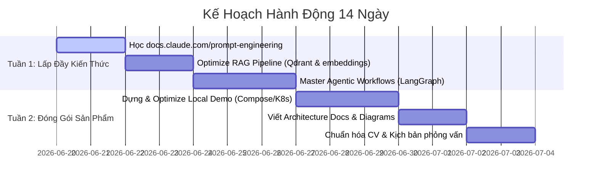
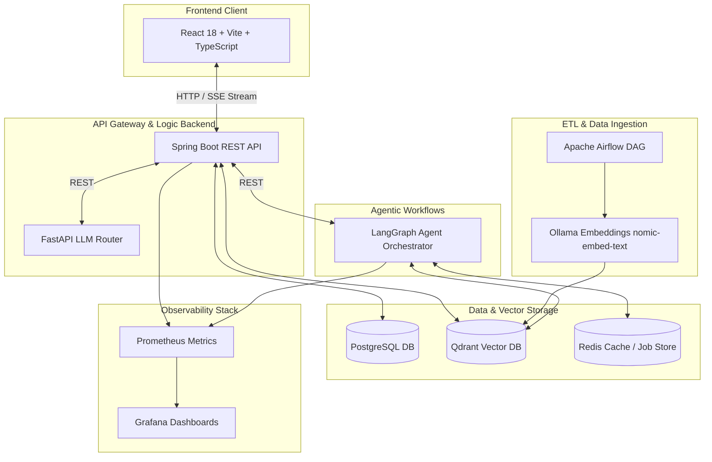

# 🚀 Lộ Trình 2 Tuần Tối Ưu Hóa Portfolio & Định Vị "AI Infrastructure Engineer"

Chào bạn! Dưới đây là chiến lược chi tiết nhằm đóng gói các kỹ năng Infra/Network sẵn có của bạn cùng với các thành phần AI (RAG, Agent, LLM Orchestration) từ hai dự án **Smart-Document-Chatbot** và **AI-Agent-Automation** thành một hồ sơ năng lực cực kỳ cạnh tranh cho vị trí **AI Infrastructure Engineer** (hoặc **AI Engineer với nền tảng Infra mạnh**).

---

## 🎯 Bản Đồ Định Vị Bản Thân: "AI Infrastructure Engineer" là gì?

Thị trường đang rất thừa "AI Wrapper Engineer" (chỉ biết gọi API OpenAI/Claude cơ bản) nhưng lại **cực kỳ thiếu** những kỹ sư hiểu sâu về:
1. **Local LLM Serving & Optimization**: Tự host, cấu hình, giới hạn phần cứng (CPU/RAM limits), và viết Router thông minh cho LLM (fallback, latency control).
2. **Vector DB Scaling & Partitioning**: Tổ chức collection, quản lý dung lượng RAM, cấu hình index vector (HNSW) trong môi trường sản xuất.
3. **Orchestration & Workflow Pipelines**: Xây dựng pipelines ETL không đồng bộ (Airflow) nạp dữ liệu vào Vector DB và dựng workflows Agent kiểm soát chất lượng (LangGraph).
4. **Production-Grade Deployments**: K8s deployments, Helm charts, PVC storage, Prometheus/Grafana monitoring và CI/CD GitOps.

Hệ thống của bạn hiện tại hội tụ đầy đủ tất cả các yếu tố trên! Mục tiêu của chúng ta là làm nổi bật các điểm sáng này.

---

## 📅 Kế Hoạch Hành Động 2 Tuần (Sprint 14 Ngày)

### 🗓️ Tuần 1: Làm Chủ Kiến Thức Ứng Dụng (AI Application Core)

#### Ngày 1 - 2: Prompt Engineering thực tế (Không chỉ là viết text)
*   **Trọng tâm học**: 
    *   *Structured Output*: Ép LLM trả về JSON Schema chuẩn để tích hợp trực tiếp vào code Backend (Spring Boot/FastAPI).
    *   *Few-shot Prompting*: Cung cấp các ví dụ mẫu chất lượng cao để định hình cách phản hồi của mô hình.
    *   *System Prompts & Safety guardrails*: Cách chặn prompt injection và rò rỉ dữ liệu nhạy cảm.
*   **Thực hành trên Codebase**:
    *   Đọc hiểu và kiểm thử file cấu hình Prompt trong hệ thống để xem cách hệ thống định dạng dữ liệu trả về (JSON schema cho citation, confidence evaluation).
    *   Tham khảo các prompt mẫu trong `d:\AI-Agent-Automation\PROMPTS.md` để hiểu cách thiết kế.

#### Ngày 3 - 4: Tối ưu RAG nâng cao (Advanced RAG Pipeline)
*   **Trọng tâm học**:
    *   *Chunking Strategy*: Tại sao lại dùng Hierarchical Chunking (phân đoạn phân tầng)?
    *   *Vector Retrieval*: Cách Qdrant tính toán cosine similarity và dùng Payload Filtering để cô lập dữ liệu theo Document ID / User ID.
    *   *Corrective Retrieval (CRAG)*: Cơ chế đánh giá điểm tin cậy (Confidence Evaluation) -> Query Reformulation (Viết lại truy vấn) -> Web Search Fallback (Tavily).
*   **Thực hành trên Codebase**:
    *   Xem cách `Smart-Document-Chatbot` triển khai CRAG loop trong file `backend/src/main/java/com/smartdocchat/service/ChatService.java` (độ tin cậy ngưỡng 0.45).
    *   Đọc hiểu Airflow DAG file `airflow/dags/document_etl.py` để nắm vững pipeline ETL nạp dữ liệu.

#### Ngày 5 - 7: Kiến trúc Agentic & Tool Calling (LangGraph)
*   **Trọng tâm học**:
    *   *Stateful Agents*: Quản lý trạng thái hội thoại và các bước suy luận của agent.
    *   *Human-in-the-loop (HITL)*: Cơ chế yêu cầu phê duyệt thủ công (Manual Approval) trước khi chạy các tác vụ nguy hiểm (Ví dụ: chạy lệnh kubectl, delete pod, email).
*   **Thực hành trên Codebase**:
    *   Nghiên cứu dự án `AI-Agent-Automation` (viết bằng Python + LangGraph).
    *   Tập trung vào phần `services/guardrail_service` và `services/approval_service` để nắm cách quản lý quyền hạn của Agent.

---

### 🗓️ Tuần 2: Đóng Gói Sản Phẩm & Triển Khai (Showcase & Infra)

#### Ngày 8 - 10: Tối ưu hóa hạ tầng triển khai (Production-Ready Deployments)
*   **Trọng tâm**: 
    *   Cấu hình Resource Limits (CPU/Memory limits) cho các container để đảm bảo hệ thống không bị crash OOM (Out Of Memory) khi LLM chạy quá tải.
    *   Cấu hình Persistent Volumes (PVC) cho cả dữ liệu tài liệu tải lên (`uploads-data`) và các file weights của mô hình Ollama (`llm-pvc`).
*   **Thực hành trên Codebase**:
    *   Bạn đang mở file `k8s/base/pvc.yml` và `docker-compose.yml`. Hãy tối ưu hóa việc phân chia tài nguyên trong `docker-compose.yml` (các lệnh `deploy.resources.limits` đã được thiết lập rất tốt, hãy hiểu sâu về nó).
    *   Thực hiện deploy thử nghiệm hệ thống bằng Docker Compose trên Local Server hoặc máy ảo cá nhân của bạn.

#### Ngày 11 - 12: Hoàn thiện Sơ đồ Kiến trúc & Hướng dẫn Sử dụng (Documentation)
*   *README là mặt tiền của dự án.* Nhà tuyển dụng chỉ dành 30 giây để lướt qua GitHub của bạn. Nếu không có sơ đồ kiến trúc rõ ràng, họ sẽ bỏ qua.
*   **Thực hành**:
    *   Viết/Cập nhật file `README.md` của cả hai dự án. Đảm bảo có sơ đồ kiến trúc hệ thống rõ ràng (sử dụng Mermaid hoặc vẽ bằng Excalidraw và xuất file ảnh).
    *   Tài liệu hóa quy trình CI/CD sử dụng GitHub Actions có sẵn.

#### Ngày 13 - 14: Viết CV & Chuẩn Bị Phỏng Vấn (Targeting & Applying)
*   Cập nhật CV theo định vị mới.
*   Luyện tập cách giải thích hệ thống theo mô hình **STAR** (Situation - Task - Action - Result).

---

## 🏗️ Tổng Quan Kiến Trúc Hệ Thống Để Giới Thiệu (Architectural Walkthrough)

Dưới đây là sơ đồ chi tiết kiến trúc kết hợp RAG, Agent, ETL Pipeline và các hạ tầng giám sát mà bạn nên tự tin trình bày trong buổi phỏng vấn hoặc ghi vào portfolio:

### 💡 Các điểm nhấn hạ tầng cần nêu bật:
1.  **Local Model Routing**: Router FastAPI (`llm-router`) tự động phát hiện độ tin cậy và cấu hình fallback sang Claude/OpenAI khi cần thiết, tiết kiệm tối đa chi phí.
2.  **Resource Contained Containers**: Mỗi container (Postgres, Qdrant, LLM, Backend) đều được cấu hình nghiêm ngặt về RAM và CPU CPU trong `docker-compose.yml`, mô phỏng chính xác môi trường Production Kubernetes.
3.  **Observability & Telemetry**: Tích hợp Prometheus thu thập Actuator metrics từ Spring Boot và Grafana để visualize latency và tỷ lệ fallback của RAG.

---

## 📝 CV Bullet Points - Hướng Dẫn Cách Viết Để Hút Nhà Tuyển Dụng

Thay vì viết chung chung "Lập trình API Spring Boot và Python", hãy dùng các mô tả đậm chất **AI Infra** dưới đây:

### 🌟 Project 1: Enterprise Agentic CRAG Platform (Smart-Document-Chatbot)
*   **Tiếng Việt**:
    *   *Thiết kế và triển khai hệ thống Agentic Corrective RAG (CRAG) đa tài liệu sử dụng Java Spring Boot phối hợp cùng mô hình cục bộ Ollama (DeepSeek-R1) và Qdrant Vector Database.*
    *   *Tối ưu hóa pipeline xử lý dữ liệu tự động (ETL) bằng Apache Airflow, phân tích tài liệu (PDF, Word, TXT) và sinh vector embeddings không đồng bộ.*
    *   *Xây dựng cơ chế tự động Fallback sang Web Search (Tavily API) khi độ tin cậy của tài liệu nội bộ thấp (Similarity Score < 0.45), đảm bảo phản hồi không bị ảo giác (hallucination).*
    *   *Đóng gói và quản lý hạ tầng triển khai cục bộ thông qua Docker Compose và Kubernetes (Manifests PVC, NodePorts), thiết lập cơ chế Prometheus & Grafana giám sát hiệu năng RAG.*
*   **Tiếng Anh**:
    *   *Designed and built an Enterprise-grade Agentic Corrective RAG (CRAG) platform leveraging Spring Boot, Qdrant Vector DB, and locally hosted LLMs via Ollama.*
    *   *Implemented asynchronous document ingestion pipeline using Apache Airflow for parsing, chunking, and embedding generation.*
    *   *Created a confidence scoring evaluation layer with self-reflective fallback strategies, reducing hallucination rates through query reformulation and Tavily Web Search integration.*
    *   *Containerized and deployed services using Docker Compose and Kubernetes manifests, configuring Persistent Volume Claims (PVC) and monitoring systems (Prometheus & Grafana).*

### 🌟 Project 2: Multi-Agent AIOps Platform (AI-Agent-Automation)
*   **Tiếng Việt**:
    *   *Xây dựng hệ thống tự động hóa xử lý sự cố hạ tầng sử dụng LangGraph (Python) phối hợp cùng các tác nhân AI (DevOps Agent, RCA Agent, Report Agent).*
    *   *Triển khai cơ chế Guardrail an toàn bảo vệ hệ thống: Tự động che dấu dữ liệu nhạy cảm (PII Masking), kiểm duyệt Prompt Injection, và thiết lập luồng phê duyệt từ con người (Human-in-the-loop) đối với các lệnh hạ tầng nhạy cảm (kubectl).*
    *   *Xây dựng hệ thống lưu trữ tác vụ nền không đồng bộ (Async Job Persistence) sử dụng Redis làm hàng đợi và lưu trữ trạng thái.*
*   **Tiếng Anh**:
    *   *Developed a multi-agent AIOps automation platform using LangGraph, orchestrating autonomous DevOps agents for infrastructure incident response.*
    *   *Integrated security guardrails including automated PII masking, prompt injection checking, and Human-in-the-Loop (HITL) approval gates for sensitive infrastructure actions.*
    *   *Architected asynchronous long-running task execution using Redis for session state management and job persistence.*

---

## 🎙️ Kịch Bản Phỏng Vấn: Cách Trả Lời Câu Hỏi Khó

### 1. "Tại sao em lại kết hợp Spring Boot (Java) với FastAPI (Python) trong dự án RAG?"
*   *Cách trả lời*: "Spring Boot cực kỳ mạnh mẽ trong việc xử lý logic nghiệp vụ truyền thống, quản lý bảo mật JWT, kết nối PostgreSQL ACID, và hỗ trợ stream phản hồi dạng Server-Sent Events (SSE) hiệu năng cao qua `SseEmitter`. Tuy nhiên, hệ sinh thái AI/LLM chủ yếu được viết bằng Python. Vì vậy, em thiết kế FastAPI đóng vai trò là một **LLM Router & Agent Service**, giúp wrap các logic như LangGraph hay local model management, sau đó giao tiếp với Spring Boot qua REST API. Kiến trúc này giúp tách biệt rạch ròi giữa Business Logic và AI Logic, nâng cao tính mở rộng (Scalability) của hệ thống."

### 2. "Làm sao em giải quyết bài toán OOM (Out Of Memory) khi chạy LLM và Vector DB trên hạ tầng bị giới hạn?"
*   *Cách trả lời*: "Đây là bài toán thực tế em đã giải quyết trực tiếp khi đóng gói container:
    1.  Với Qdrant: Em cấu hình RAM limit ở mức 1GB và cpus '0.5' trong file Docker Compose, đồng thời bật nén payload để giảm dung lượng bộ nhớ.
    2.  Với Ollama (LLM): Em tận dụng mô hình nhỏ có hiệu năng cao như `llama3.2:3b` để tiết kiệm VRAM/RAM, và cài đặt timeout nghiêm ngặt qua `llm-router` để ngắt các request bị treo.
    3.  Trên Kubernetes base: Em cấu hình PersistentVolumeClaim để lưu trữ cố định weights của LLM và tài liệu, tránh việc tải lại mô hình khi container bị khởi động lại."

---

Chúc bạn có một đợt chuẩn bị portfolio và apply thành công! Bất kỳ bước thực hành nào ở trên cần tối ưu thêm code, hãy phản hồi để mình cùng viết nhé.
