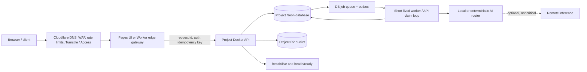

# Cross-project local-first infrastructure and operating model

**Status:** approved architecture; awaiting review of this written specification  
**Scope:** ApexInspect-AI, CreditFlow, RecSys-AI, Smart-Document-Chatbot, and Video-Agent

## 1. Purpose and decisions

The five applications must remain independently deployable while sharing a safe, inexpensive operating pattern. The chosen pattern is **local-first durable core plus demo bridge**:

- Docker is the standard package for every backend. Docker Compose is for local development and integration tests, not the production database or queue.
- Each project owns its own Neon project (or isolated database branch during an early non-production phase), R2 bucket, Cloudflare route, secrets, job queue, and dead-letter records.
- Neon is the source of truth for workflows, audit trails, idempotency records, outbox events, job state, and model/version registries.
- R2 stores immutable object payloads only: uploaded documents, images, video artefacts, and evaluation/evidence files. Database rows carry object keys, checksums, content type, creator, version, and retention policy.
- Render Free is a public demo/portfolio bridge only. It is not relied upon for durable workers, local disk, scheduled processing, or a fixed low-latency SLO.
- AI is local or deterministic by default. Hugging Face and other remote inference are optional, asynchronous, budget-limited, and fail closed; no safety decision or irreversible action may depend on a remote model response.

This is an operating model, not a mandate to make the five codebases into one distributed application. There is no shared production database, shared R2 bucket, or shared queue.

## 2. Reference request and data flow

The edge gateway is deliberately thin: validate origin, authenticate, attach a request ID, enforce rate limits, require idempotency where a state transition is possible, and route to the project API. Domain authorization, validation, business rules, and persistence remain in the backend.

For a long operation, the API stores a transactionally valid job and returns `202 Accepted` with `job_id`, `status_url`, and request ID. A worker claims the job atomically, processes it with bounded retries, records evidence, and writes an outbox event. Any terminal failure is visible through the status endpoint and audit log; it is never silently represented as success.

## 3. Isolation boundary

| Boundary | Rule | Result |
|---|---|---|
| Network | One hostname/route namespace per project | A routing or CORS error cannot expose another application |
| Database | One Neon project per project in production | No cross-project tables, roles, migrations, or backup blast radius |
| Object storage | One R2 bucket per project | Object keys and signed URLs cannot cross product boundaries |
| Secrets | Separate secret sets and service tokens | Rotating one service does not interrupt another |
| Workflow | Separate queue, idempotency, retry and DLQ tables | Backlog and poison messages are contained |
| CI/CD | Separate image, migrations, smoke checks, and rollback | Each project ships and rolls back independently |

Do not use a single shared `platform` database or “utilities” bucket as an early convenience. If a future cross-product feature needs data exchange, it must use versioned, authenticated events or APIs with explicit data ownership and retention rules.

## 4. Environments and Docker contract

| Environment | Intended use | State | Restrictions |
|---|---|---|---|
| Local | Development and reproducible integration tests | Compose-managed dependencies may be used | Test data only; no production credentials |
| Durable staging | Pre-release verification | Neon + R2; migration and seed data are explicit | Same health, auth, migration, and rollback gates as release |
| Public demo | Portfolio and stakeholder access | Render Free web service, backed by durable external state | Accept cold starts; no durable background worker or local-file dependency |
| Production | Later paid/committed operating tier | Same image and contracts as staging | Capacity and availability decisions are made explicitly, not inferred from free tiers |

Every image must run as a non-root user, expose a port through configuration, avoid writing required state to its container filesystem, and provide `/health/live` and `/health/ready`:

- **live**: process can serve requests; it does not require external dependencies.
- **ready**: configuration is valid and required dependencies can be reached without mutating state.

Container startup must not run destructive schema operations. Migrations are a separately logged release step. A failed migration blocks release and leaves the prior compatible image serving.

## 5. Durable workflow contract

The smallest shared contract is a database-backed queue; Redis is not required solely to make a job durable.

Each project has the following conceptual records:

- `idempotency_keys`: caller scope, key, request fingerprint, final response/status, expiry.
- `jobs`: immutable input reference, status (`queued`, `running`, `succeeded`, `failed`, `dead_lettered`, `cancelled`), attempt count, lease expiry, result/evidence references, and error class.
- `outbox_events`: event payload/version, destination, delivery attempts, next retry time, and delivery evidence.
- `dead_letters`: terminal failure input reference, safe diagnostic, owner, and replay decision.
- `audit_events`: actor, action, object, request ID, outcome, reason, and timestamps.

Queue claims must be atomic and lease-based. A worker whose lease expires may be retried; the operation itself must be idempotent. Replays require an explicit operator action and preserve the original evidence trail. Side effects such as purchases, PLC commands, credit decisions, or externally delivered media are never retried blindly.

## 6. AI and RAG policy

1. Prefer deterministic validation, local models, cached retrieval, and rule-based safety checks.
2. Treat remote AI as an optional capability behind a provider interface, timeout, circuit breaker, concurrency cap, and per-project budget guardrail.
3. Persist prompt/template version, model/provider, retrieval corpus version, document IDs/chunks, score thresholds, latency, token/cost estimate when available, and final disposition. Do not persist raw sensitive data unless that project’s retention policy permits it.
4. A remote provider outage yields an explicit `unavailable` or a deterministic fallback. It must not invent an approval, dispatch a command, complete a cart, publish a result, or claim a job succeeded.
5. Retrieval updates are versioned and evaluated before promotion; failures in retraining or indexing retain the last known-good corpus/model.

## 7. Project-specific minimum remediation

| Project | First infrastructure outcome |
|---|---|
| ApexInspect-AI | Replace default SQLite operational state with Neon; standardize liveness/readiness/metrics; make PLC failures explicit and durable; keep deterministic inspection as the safe baseline. |
| CreditFlow | Move MLflow/SQLite runtime state to durable services; align Render deployment with Docker; add readiness and model-artifact provenance; require auditable decision evidence before action. |
| RecSys-AI | Preserve its current non-root Docker, Alembic, and live/ready strengths; replace SQLite/in-memory runtime dependencies with Neon and an explicitly durable vector strategy; keep shopping operations proposed until acknowledged. |
| Smart-Document-Chatbot | Make the multi-service topology explicit; verify Neon, R2 and Qdrant provisioning rather than templates alone; standardize health; route retraining/indexing through durable job records and trace/evaluation gates. |
| Video-Agent | Add a non-root Docker image and durable Neon/R2 backing; replace local output assumptions; promote the existing job worker pattern into transactional queue/outbox/DLQ semantics; retain mock providers as the default offline path. |

## 8. Security, observability, and release gates

### Security baseline

- Enforce HTTPS at Cloudflare, restrictive CORS allowlists, request-size limits, rate limits, and bot controls appropriate to public endpoints.
- Separate public API credentials from internal worker credentials. Internal callbacks use short-lived or rotating signed credentials and replay protection.
- Use signed, short-lived object URLs; do not proxy arbitrary object keys.
- Keep all secrets in deployment configuration, never images, repository files, browser bundles, logs, or trace attributes.

### Observability baseline

Every inbound request, job, provider call, and state transition carries a correlation/request ID. Structured logs must include it, safely redacted actor/project identity, outcome, duration, error class, and retry count. The minimum dashboard/alert views are:

- API availability, readiness failures, and p95 latency.
- Queue depth, oldest queued age, retry rate, leases expired, and DLQ count.
- Database connection failures and migration version.
- R2 upload/download failures and checksum mismatch.
- AI provider failures, fallback rate, evaluation regressions, and budget consumption.

Alerts are actionable: an owner, a runbook link, and a clear condition. Free demo hosting should alert on user-visible failure and durable workflow backlog, not on transient container cold starts alone.

### CI/CD release gate

Before a release: build the Docker image, run unit/integration tests, run a non-mutating readiness smoke test, apply/verify migrations in staging, execute one idempotency replay test and one failed-job/DLQ test, and confirm no secrets or mutable local paths are required. Rollback means deploy the prior compatible image, stop new job claims if needed, and preserve database/audit evidence for reconciliation.

## 9. Delivery sequence

1. **Foundation:** normalize Dockerfiles, configuration validation, `/health/live`, `/health/ready`, request IDs, and non-root images.
2. **Edge and access:** configure per-project Cloudflare routes, origin restrictions, rate limits, and authentication boundaries.
3. **Durable state:** provision isolated Neon and R2 resources; add migrations, storage metadata, checksums, and signed-URL policy.
4. **Reliable async work:** add idempotency, jobs, leases, outbox, retry classification, DLQ, and operator replay rules.
5. **AI/RAG safety:** add provider adapters, fail-closed behavior, retrieval/model versioning, evaluation gates, and cost limits.
6. **Operate:** add dashboards, runbooks, backup/restore exercise, release gates, and a staged rollout per project.

Each project completes a phase independently. Shared conventions may be copied as templates, but deployment or release of one project never blocks another.

## 10. Free-tier guardrails and decision points

Cloudflare’s free allowances are useful for the edge and small object workloads, but quotas must be checked against the current provider documentation before every production commitment. Cloudflare Workers and Queues have request/operation limits; R2 has storage and operation limits, though egress economics can be favorable. Render Free services can sleep and their filesystem is ephemeral, so they are intentionally limited to demo traffic. Hugging Face remote inference credits and endpoint pricing are not a durable free production guarantee. Neon plan capacity and retention must be verified in the account/console at provisioning time rather than encoded as assumptions in this document.

Authoritative references: [Cloudflare Workers limits](https://developers.cloudflare.com/workers/platform/limits/), [Cloudflare Queues pricing](https://developers.cloudflare.com/queues/platform/pricing/), [Cloudflare R2 pricing](https://developers.cloudflare.com/r2/pricing/), [Render Free](https://render.com/docs/free), and [Hugging Face Inference Providers pricing](https://huggingface.co/docs/inference-providers/pricing/).

Before moving a project from demo to production, its owner must choose a paid/committed availability tier, set an explicit monthly budget ceiling, and complete a restore rehearsal. “Free tier still works” is not an SLO.

## 11. Acceptance criteria for this design

The design is realized for an individual project when:

- its backend image is reproducible, non-root, and stateless beyond Neon/R2;
- live and readiness endpoints have distinct semantics and are monitored;
- state-changing calls require an idempotency contract and leave an audit trail;
- long-running work is visible, retriable safely, and reaches a terminal status or DLQ;
- object references are isolated to its R2 bucket and validated by metadata/checksum;
- remote AI failure cannot create an unsafe success state;
- a release has passed staging migration, smoke, failure-path, and rollback checks; and
- a restore/reconciliation runbook has been exercised with evidence.
